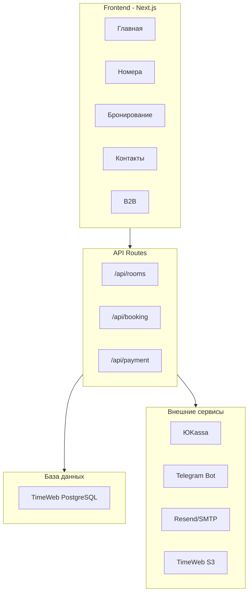

# План реализации сайта DELAS

## Общая архитектура

---

## Фаза 1: Инициализация проекта

### 1.1 Создание Next.js приложения

- Инициализация `create-next-app` с TypeScript и Tailwind
- Структура папок согласно [TECH_STACK.md](TECH_STACK.md) (строки 80-160)
- Файлы: `package.json`, `tsconfig.json`, `next.config.js`

### 1.2 Настройка Tailwind и CSS Variables

- Файл: `src/app/globals.css`
- Опираться на: [DESIGN_GUIDELINES.md](DESIGN_GUIDELINES.md) (строки 289-318) - CSS Variables
- Цветовая палитра: терракота `#C4704A`, песок `#F5F0E8`
- Подключение шрифтов Unbounded + Golos Text

### 1.3 Установка Shadcn/ui

- Компоненты: Button, Input, Calendar, Card, Dialog, Select
- Кастомизация под нашу палитру

### 1.4 Настройка Prisma

- Файл: `prisma/schema.prisma`
- Схема согласно [TECH_STACK.md](TECH_STACK.md) (строки 162-193)
- Таблицы: RoomType, Booking, HotelSettings, BlockedDate

**UPDATE ТОЧКА 1:** После этой фазы обновить `src/constants/hotel.ts` с реальными данными хостела.---

## Фаза 2: Дизайн-система и компоненты

### 2.1 Layout компоненты

- `src/components/layout/Header.tsx` - навигация + логотип
- `src/components/layout/Footer.tsx` - контакты + ссылки
- `src/components/layout/MobileNav.tsx` - мобильное меню
- Опираться на: [DESIGN_GUIDELINES.md](DESIGN_GUIDELINES.md) (строки 158-216) - структура страниц

### 2.2 Shared компоненты

- `src/components/shared/Container.tsx` - контейнер страницы
- `src/components/shared/Badge.tsx` - бейджи (женский номер, скидка)
- `src/components/shared/PhoneButton.tsx` - кнопка звонка (click-to-call)

### 2.3 Room компоненты

- `src/components/rooms/RoomCard.tsx` - карточка номера
- `src/components/rooms/RoomGallery.tsx` - галерея фото
- `src/components/rooms/RoomList.tsx` - список номеров
- Опираться на: [DESIGN_GUIDELINES.md](DESIGN_GUIDELINES.md) (строки 418-442) - спецификация карточек

### 2.4 Booking компоненты

- `src/components/booking/DatePicker.tsx` - выбор дат
- `src/components/booking/GuestForm.tsx` - форма гостя
- `src/components/booking/PriceCalculator.tsx` - расчёт цены со скидками
- `src/components/booking/BookingForm.tsx` - полная форма бронирования
- Опираться на: [DESIGN_GUIDELINES.md](DESIGN_GUIDELINES.md) (строки 444-464)

**UPDATE ТОЧКА 2:** После создания компонентов проверить тексты в карточках на соответствие [BUSINESS_INFO.md](BUSINESS_INFO.md) (строки 17-46).---

## Фаза 3: Страницы

### 3.1 Главная страница (/)

- Файл: `src/app/page.tsx`
- Hero с формой бронирования
- Секция "Что включено"
- Карточки номеров
- Блок скидок
- Блок B2B
- Карта
- Опираться на: [DESIGN_GUIDELINES.md](DESIGN_GUIDELINES.md) (строки 158-216) - wireframe главной
- SEO: [BUSINESS_INFO.md](BUSINESS_INFO.md) (строки 150-155)

### 3.2 Страница номеров (/rooms)

- Файл: `src/app/rooms/page.tsx`
- Список всех категорий номеров
- Фильтры (опционально)

### 3.3 Детали номера (/rooms/[slug])

- Файл: `src/app/rooms/[slug]/page.tsx`
- Галерея фото
- Описание и удобства
- Форма бронирования с калькулятором
- Опираться на: [DESIGN_GUIDELINES.md](DESIGN_GUIDELINES.md) (строки 218-258)

### 3.4 Бронирование (/booking)

- Файл: `src/app/booking/page.tsx`
- Полная форма бронирования
- Валидация через Zod

### 3.5 Успешное бронирование (/booking/success)

- Файл: `src/app/booking/success/page.tsx`
- Подтверждение брони
- Детали для гостя

### 3.6 Контакты (/contacts)

- Файл: `src/app/contacts/page.tsx`
- Карта (Яндекс.Карты или 2ГИС)
- Контактная информация
- Форма обратной связи

### 3.7 Для организаций (/corporate)

- Файл: `src/app/corporate/page.tsx`
- Условия для B2B
- Форма заявки
- Опираться на: [BUSINESS_INFO.md](BUSINESS_INFO.md) (строки 87-92)

**UPDATE ТОЧКА 3:** После создания страниц обновить все тексты согласно [BUSINESS_INFO.md](BUSINESS_INFO.md).---

## Фаза 4: API и бизнес-логика

### 4.1 API для номеров

- `src/app/api/rooms/route.ts` - GET список номеров
- `src/app/api/rooms/[slug]/route.ts` - GET детали номера

### 4.2 API для бронирования

- `src/app/api/booking/route.ts` - POST создание брони
- `src/app/api/booking/check/route.ts` - POST проверка доступности
- `src/app/api/booking/[id]/route.ts` - GET статус брони
- Опираться на: [TECH_STACK.md](TECH_STACK.md) (строки 197-210)

### 4.3 Валидация

- Файл: `src/lib/validators.ts`
- Zod схемы для всех форм

### 4.4 Утилиты

- `src/lib/utils.ts` - cn(), formatPrice(), formatDate()
- `src/lib/prisma.ts` - Prisma client singleton

---

## Фаза 5: Интеграции

### 5.1 ЮKassa

- Файл: `src/lib/yookassa.ts`
- `src/app/api/payment/create/route.ts` - создание платежа
- `src/app/api/payment/webhook/route.ts` - обработка webhook
- Опираться на: [TECH_STACK.md](TECH_STACK.md) (строки 52-57)

### 5.2 Telegram уведомления

- Файл: `src/lib/telegram.ts`
- Отправка сообщений при новом бронировании
- Формат сообщения с деталями брони

### 5.3 Email уведомления

- Файл: `src/lib/email.ts`
- Подтверждение брони клиенту
- HTML шаблон письма

### 5.4 S3 для медиа (опционально)

- Файл: `src/lib/s3.ts`
- Загрузка фото номеров

**UPDATE ТОЧКА 4:** Настроить реальные API ключи в `.env` перед деплоем.---

## Фаза 6: SEO и оптимизация

### 6.1 Meta-теги

- Файл: `src/constants/seo.ts`
- Файл: `src/app/layout.tsx` - глобальные meta
- Опираться на: [BUSINESS_INFO.md](BUSINESS_INFO.md) (строки 129-155)

### 6.2 OpenGraph изображение

- Файл: `public/og-image.jpg` (1200x630)
- Создать на основе логотипа

### 6.3 Sitemap и robots.txt

- `src/app/sitemap.ts`
- `src/app/robots.ts`

### 6.4 Производительность

- Оптимизация изображений (next/image)
- Lazy loading для галерей

---

## Фаза 7: Данные и тестирование

### 7.1 Seed данные

- Файл: `prisma/seed.ts`
- Заполнение номеров с временными данными
- Опираться на: [BUSINESS_INFO.md](BUSINESS_INFO.md) (строки 17-46)

### 7.2 Тестирование

- Проверка флоу бронирования
- Тест оплаты (тестовый режим ЮKassa)
- Проверка уведомлений

**UPDATE ТОЧКА 5:** Заменить seed данные на реальные цены и описания.---

## Фаза 8: Деплой

### 8.1 Подготовка

- Создать `.env.example`
- Проверить все переменные окружения
- Опираться на: [TECH_STACK.md](TECH_STACK.md) (строки 241-273)

### 8.2 TimeWeb Cloud

- Создать PostgreSQL
- Настроить приватную сеть
- Создать App Platform
- Подключить репозиторий
- Опираться на: [TECH_STACK.md](TECH_STACK.md) (строки 277-307)

### 8.3 Финальная проверка

- Чек-лист: [TECH_STACK.md](TECH_STACK.md) (строки 338-352)
- UX чек-лист: [DESIGN_GUIDELINES.md](DESIGN_GUIDELINES.md) (строки 510-540)

---

## Точки обновления текстов (UPDATE POINTS)

| Точка | Когда | Что обновить | Файл-источник ||-------|-------|--------------|---------------|| 1 | После инициализации | Данные хостела (адрес, телефон) | `src/constants/hotel.ts` || 2 | После компонентов | Тексты в карточках номеров | Компоненты в `src/components/` || 3 | После страниц | Все тексты на страницах | Страницы в `src/app/` || 4 | Перед интеграциями | API ключи | `.env` || 5 | Перед деплоем | Реальные цены и описания | `prisma/seed.ts`, константы |---

## Файлы документации - когда использовать