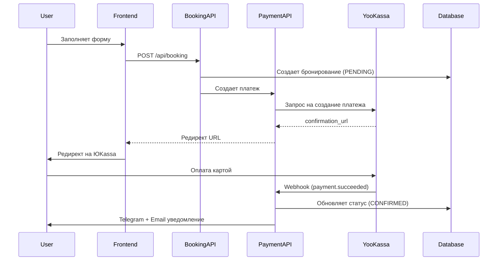

# Локальная настройка БД и интеграция ЮKassa

## Шаг 1: Установка PostgreSQL на Mac

```bash
# Через Homebrew
brew install postgresql@16
brew services start postgresql@16

# Создание базы данных
createdb delas_dev
```

После установки создадим файл `.env.local` с подключением:

```javascript
DATABASE_URL="postgresql://localhost:5432/delas_dev"
```


## Шаг 2: Инициализация Prisma

```bash
npx prisma db push    # Создание таблиц
npm run db:seed       # Заполнение данных
npx prisma studio     # Проверка через UI
```


## Шаг 3: Регистрация в ЮKassa

1. Зарегистрироваться на [yookassa.ru](https://yookassa.ru)
2. Создать тестовый магазин (sandbox режим)
3. Получить:

- `shopId` (идентификатор магазина)
- `secretKey` (секретный ключ)

4. Добавить в `.env.local`:
   ```javascript
                           YOOKASSA_SHOP_ID="xxxxxx"
                           YOOKASSA_SECRET_KEY="test_xxxxx"
   ```


## Шаг 4: Реализация ЮKassa интеграции

Создать следующие API endpoints в [`src/app/api/payment/`](src/app/api/payment/):| Файл | Назначение ||------|------------|| `create/route.ts` | Создание платежа после бронирования || `webhook/route.ts` | Прием уведомлений от ЮKassa об оплате || `status/route.ts` | Проверка статуса платежа |**Логика flow:**




## Шаг 5: Обновление формы бронирования

Изменить [`src/components/booking/BookingForm.tsx`](src/components/booking/BookingForm.tsx):

- После submit -> вызвать API -> получить URL оплаты -> редирект на ЮKassa

## Шаг 6: Страницы результата оплаты

Создать:

- `/booking/success` — успешная оплата
- `/booking/cancel` — отмена оплаты

## Шаг 7: Базовые тесты

Добавить зависимости для тестирования:

```bash
npm install -D vitest @testing-library/react @testing-library/jest-dom
```

Создать тесты:

- Валидация форм