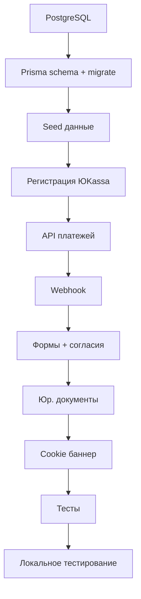

# Полная настройка с учётом законодательства РФ

## Требования законодательства (что учитываем)

| Закон | Требование | Реализация ||-------|------------|------------|| **152-ФЗ** | Хранение ПД в РФ | TimeWeb Cloud (РФ) || **152-ФЗ** | Согласие на обработку ПД | Чекбокс в формах + запись в БД || **152-ФЗ** | Политика конфиденциальности | Страница /privacy || **54-ФЗ** | Онлайн-чеки | ЮKassa receipt API || **2300-1** | Оферта | Страница /terms || **GDPR-style** | Cookie consent | Баннер + запись согласия |---

## Часть 1: База данных

### 1.1 Установка PostgreSQL на Mac

```bash
brew install postgresql@16
brew services start postgresql@16
createdb delas_dev
```


### 1.2 Обновление Prisma схемы

Добавить в [`prisma/schema.prisma`](prisma/schema.prisma):

```prisma
// Согласие на обработку ПД (152-ФЗ)
model Consent {
  id          String   @id @default(cuid())
  
  // Типы согласия
  type        ConsentType
  
  // Данные пользователя
  email       String?
  phone       String?
  ip          String
  userAgent   String
  
  // Статус
  accepted    Boolean
  acceptedAt  DateTime @default(now())
  
  // Связь с бронированием (если есть)
  bookingId   String?
  booking     Booking? @relation(fields: [bookingId], references: [id])
  
  @@index([email])
  @@index([phone])
  @@index([type])
}

enum ConsentType {
  PERSONAL_DATA    // Согласие на обработку ПД
  MARKETING        // Согласие на рекламу
  COOKIES          // Согласие на cookies
}

// Обновить Booking - добавить поля для чеков
model Booking {
  // ... существующие поля ...
  
  // Фискализация (54-ФЗ)
  receiptId     String?       // ID чека в ЮKassa
  receiptStatus String?       // pending, succeeded, canceled
  
  // Согласия
  consents      Consent[]
}
```


### 1.3 Создание .env.local

```env
# База данных (локальная)
DATABASE_URL="postgresql://localhost:5432/delas_dev"

# ЮKassa (тестовые ключи - получить после регистрации)
YOOKASSA_SHOP_ID="xxxxxx"
YOOKASSA_SECRET_KEY="test_xxxxx"

# Telegram (уже есть)
TELEGRAM_BOT_TOKEN="8400034110:AAHkh96CRYyCH9yGnOGtnXazNsi2eAcv5xE"
TELEGRAM_CHAT_ID="433221767"

# Сайт
NEXT_PUBLIC_SITE_URL="http://localhost:3000"

# ИП данные для чеков (54-ФЗ)
BUSINESS_INN="232013753049"
BUSINESS_NAME="ИП Кочетков Данил Дмитриевич"
```

---

## Часть 2: Интеграция ЮKassa

### 2.1 Создание платежа с чеком (54-ФЗ)

Файл: [`src/app/api/payment/create/route.ts`](src/app/api/payment/create/route.ts)

```typescript
// Структура запроса к ЮKassa с receipt (54-ФЗ)
const paymentData = {
  amount: { value: "1200.00", currency: "RUB" },
  capture: true,
  confirmation: {
    type: "redirect",
    return_url: `${SITE_URL}/booking/success?id=${bookingId}`
  },
  description: `Бронирование #${bookingId}`,
  metadata: { booking_id: bookingId },
  
  // Чек для 54-ФЗ
  receipt: {
    customer: {
      email: guestEmail,
      phone: guestPhone
    },
    items: [{
      description: `Проживание: ${roomName}, ${nights} ночей`,
      quantity: "1.00",
      amount: { value: "1200.00", currency: "RUB" },
      vat_code: 1,  // НДС не облагается (для ИП на УСН)
      payment_subject: "service",
      payment_mode: "full_prepayment"
    }]
  }
}
```


### 2.2 Webhook для обработки оплаты

Файл: [`src/app/api/payment/webhook/route.ts`](src/app/api/payment/webhook/route.ts)

- Проверка подписи от ЮKassa
- Обновление статуса бронирования
- Отправка уведомлений (Telegram + Email)

### 2.3 Страницы результата

- `/booking/success` - успешная оплата
- `/booking/cancel` - отмена/ошибка

---

## Часть 3: Юридические документы

### 3.1 Обновить /privacy (Политика конфиденциальности)

Добавить в [`src/app/privacy/page.tsx`](src/app/privacy/page.tsx):

- Оператор ПД: ИП Кочетков Данил Дмитриевич, ИНН 232013753049
- Какие данные собираем (ФИО, телефон, email)
- Цели обработки (бронирование, связь с гостем)
- Срок хранения данных
- Права субъекта ПД (доступ, удаление, отзыв согласия)
- Контакты для обращений

### 3.2 Обновить /terms (Оферта)

Добавить в [`src/app/terms/page.tsx`](src/app/terms/page.tsx):

- Реквизиты ИП
- Описание услуг
- Порядок бронирования и оплаты
- Правила заселения/выселения
- Правила отмены и возврата
- Ответственность сторон

### 3.3 Создать Cookie Consent баннер

Компонент [`src/components/layout/CookieConsent.tsx`](src/components/layout/CookieConsent.tsx):

- Баннер внизу экрана
- Кнопки "Принять" / "Настроить"
- Сохранение согласия в localStorage + API

---

## Часть 4: Обновление форм

### 4.1 Добавить чекбокс согласия в BookingForm

```tsx
<label className="flex items-start gap-2">
  <input type="checkbox" required {...register('consentPersonalData')} />
  <span className="text-sm">
    Я даю согласие на обработку персональных данных в соответствии с{' '}
    <Link href="/privacy">Политикой конфиденциальности</Link>
  </span>
</label>
```


### 4.2 Запись согласия в БД

При создании бронирования записывать:

- IP адрес
- User Agent
- Время согласия
- Тип согласия

---

## Часть 5: Тестирование

### 5.1 Настройка Vitest

```bash
npm install -D vitest @testing-library/react
```


### 5.2 Тесты для проверки

| Тест | Что проверяем ||------|---------------|| `validators.test.ts` | Валидация форм (телефон, email) || `utils.test.ts` | Расчёт скидок, цен || `booking.test.ts` | Создание бронирования || `payment.test.ts` | Создание платежа (мок ЮKassa) |---

## Порядок выполнения



---

## Результат

После выполнения плана:

- Полностью рабочий flow бронирования с оплатой
- Соответствие 152-ФЗ (согласия, политика ПД)
- Соответствие 54-ФЗ (онлайн-чеки через ЮKassa)