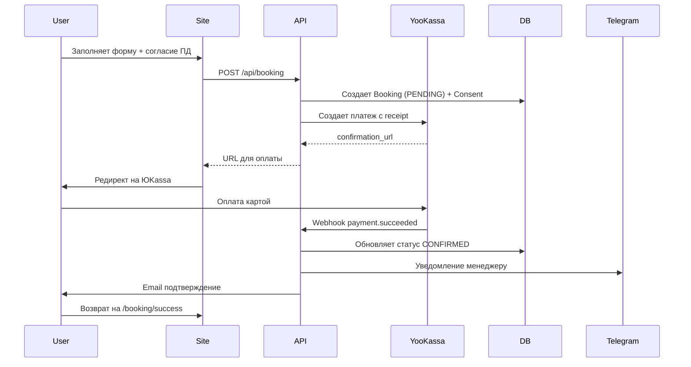

# Полная настройка хостела DELAS

## Обзор

Этот план охватывает полную настройку backend-части сайта хостела:

- Локальная база данных PostgreSQL
- Платежи через ЮKassa с онлайн-чеками (54-ФЗ)
- Соответствие закону о персональных данных (152-ФЗ)
- Юридические документы (оферта, политика конфиденциальности)
- Тестирование

---

## Законодательные требования

| Закон | Требование | Как реализуем ||-------|------------|---------------|| 152-ФЗ | Хранение ПД в РФ | TimeWeb Cloud (серверы в РФ) || 152-ФЗ | Согласие на обработку | Чекбокс + запись в БД || 152-ФЗ | Политика конфиденциальности | Страница `/privacy` || 54-ФЗ | Онлайн-чеки | ЮKassa receipt API || 2300-1 | Публичная оферта | Страница `/terms` |---

## Этап 1: Инфраструктура (локальная разработка)

### 1.1 Установка PostgreSQL

```bash
brew install postgresql@16
brew services start postgresql@16
createdb delas_dev
```


### 1.2 Создание `.env.local`

```env
# База данных
DATABASE_URL="postgresql://localhost:5432/delas_dev"

# ЮKassa (заполнить после регистрации)
YOOKASSA_SHOP_ID=""
YOOKASSA_SECRET_KEY=""

# Telegram (уже настроено)
TELEGRAM_BOT_TOKEN="8400034110:AAHkh96CRYyCH9yGnOGtnXazNsi2eAcv5xE"
TELEGRAM_CHAT_ID="433221767"

# Сайт
NEXT_PUBLIC_SITE_URL="http://localhost:3000"

# Реквизиты ИП для чеков (54-ФЗ)
BUSINESS_INN="232013753049"
BUSINESS_NAME="ИП Кочетков Данил Дмитриевич"
```


### 1.3 Обновление Prisma схемы

Добавить в [`prisma/schema.prisma`](prisma/schema.prisma):

```prisma
// Согласие на обработку ПД (152-ФЗ)
model Consent {
  id          String      @id @default(cuid())
  type        ConsentType
  email       String?
  phone       String?
  ip          String
  userAgent   String
  accepted    Boolean
  acceptedAt  DateTime    @default(now())
  bookingId   String?
  booking     Booking?    @relation(fields: [bookingId], references: [id])
  
  @@index([email])
  @@index([phone])
}

enum ConsentType {
  PERSONAL_DATA
  MARKETING
  COOKIES
}
```

Добавить в модель `Booking`:

```prisma
  receiptId     String?   // ID чека ЮKassa
  receiptStatus String?   // pending, succeeded, canceled
  consents      Consent[]
```


### 1.4 Инициализация БД

```bash
npx prisma db push
npm run db:seed
npx prisma studio  # проверка
```

---

## Этап 2: Регистрация ЮKassa

**Действия пользователя:**

1. Перейти на [yookassa.ru](https://yookassa.ru) и зарегистрироваться
2. Создать тестовый магазин (sandbox)
3. Получить `shopId` и `secretKey`
4. Добавить ключи в `.env.local`

---

## Этап 3: Интеграция платежей

### 3.1 API создания платежа

Файл: `src/app/api/payment/create/route.ts`

```typescript
// POST /api/payment/create
// Создает платеж в ЮKassa с чеком (54-ФЗ)

const paymentData = {
  amount: { value: totalPrice.toFixed(2), currency: "RUB" },
  capture: true,
  confirmation: {
    type: "redirect",
    return_url: `${SITE_URL}/booking/success?id=${bookingId}`
  },
  metadata: { booking_id: bookingId },
  
  // Чек для 54-ФЗ
  receipt: {
    customer: { email, phone },
    items: [{
      description: `Проживание: ${roomName}, ${nights} ночей`,
      quantity: "1.00",
      amount: { value: totalPrice.toFixed(2), currency: "RUB" },
      vat_code: 1,  // Без НДС (УСН)
      payment_subject: "service",
      payment_mode: "full_prepayment"
    }]
  }
}
```


### 3.2 Webhook обработки оплаты

Файл: `src/app/api/payment/webhook/route.ts`

- Прием POST от ЮKassa
- Проверка подписи запроса
- Обновление статуса бронирования в БД
- Отправка уведомлений (Telegram + Email)

### 3.3 Страницы результата

| Страница | Назначение ||----------|------------|| `/booking/success` | Успешная оплата, детали бронирования || `/booking/cancel` | Отмена/ошибка, кнопка повторить |---

## Этап 4: Обновление форм

### 4.1 Форма бронирования

Изменить [`src/components/booking/BookingForm.tsx`](src/components/booking/BookingForm.tsx):

1. Добавить чекбокс согласия на обработку ПД:
```tsx
<label className="flex items-start gap-2">
  <input type="checkbox" required {...register('consentPD')} />
  <span className="text-sm">
    Даю согласие на обработку персональных данных согласно{' '}
    <Link href="/privacy">Политике конфиденциальности</Link>
  </span>
</label>
```


2. После submit: вызов API -> получение URL -> редирект на ЮKassa

### 4.2 Запись согласия

При создании бронирования сохранять в таблицу `Consent`:

- IP адрес (из headers)
- User Agent
- Время согласия
- Тип: `PERSONAL_DATA`

---

## Этап 5: Юридические документы

### 5.1 Политика конфиденциальности (`/privacy`)

Обновить [`src/app/privacy/page.tsx`](src/app/privacy/page.tsx):

- **Оператор:** ИП Кочетков Данил Дмитриевич, ИНН 232013753049
- **Какие данные:** ФИО, телефон, email, IP
- **Цели:** бронирование, связь с гостем, улучшение сервиса
- **Срок хранения:** 3 года после последнего бронирования
- **Права:** доступ, изменение, удаление, отзыв согласия
- **Контакты:** info@hostel-delas.ru, +7 (988) 181-47-77

### 5.2 Оферта (`/terms`)

Обновить [`src/app/terms/page.tsx`](src/app/terms/page.tsx):

- Реквизиты ИП
- Описание услуг размещения
- Порядок бронирования и оплаты
- Время заезда (14:00) и выезда (12:00)
- Правила отмены и возврата
- Правила проживания (запрет алкоголя, питомцев)
- Ответственность сторон

### 5.3 Cookie Consent баннер

Создать [`src/components/layout/CookieConsent.tsx`](src/components/layout/CookieConsent.tsx):

- Фиксированный баннер внизу экрана
- Текст: "Мы используем cookies для улучшения работы сайта"
- Кнопки: "Принять" / "Подробнее"
- Сохранение согласия в `localStorage` + отправка в API

---

## Этап 6: Полное тестирование (100% покрытие)

### 6.1 Настройка тестового окружения

```bash
# Тестовый фреймворк + покрытие
npm install -D vitest @vitest/coverage-v8

# Тестирование React компонентов
npm install -D @testing-library/react @testing-library/jest-dom @testing-library/user-event

# Моки HTTP запросов
npm install -D msw

# E2E тестирование
npm install -D @playwright/test
npx playwright install
```

Конфигурация `vitest.config.ts`:

```typescript
import { defineConfig } from 'vitest/config'
import react from '@vitejs/plugin-react'
import path from 'path'

export default defineConfig({
  plugins: [react()],
  test: {
    environment: 'jsdom',
    setupFiles: ['./src/__tests__/setup.ts'],
    coverage: {
      provider: 'v8',
      reporter: ['text', 'html'],
      exclude: ['node_modules/', '.next/']
    }
  },
  resolve: {
    alias: { '@': path.resolve(__dirname, './src') }
  }
})
```

---

### 6.2 Unit тесты

#### `src/__tests__/unit/validators.test.ts`

| Тест | Описание ||------|----------|| `validatePhone` | Корректные форматы: +7, 8, без кода || `validatePhone` | Некорректные: короткий, буквы, спецсимволы || `validateEmail` | Корректные email адреса || `validateEmail` | Некорректные: без @, без домена || `createBookingSchema` | Полная валидация формы бронирования || `corporateRequestSchema` | Валидация корп. заявки || `guestFormSchema` | Валидация данных гостя |

#### `src/__tests__/unit/utils.test.ts`

| Тест | Описание ||------|----------|| `calculateNights` | 1 ночь, 7 ночей, 30 ночей || `calculateNights` | Граничные случаи (0, отрицательные) || `calculateDiscount` | 0% при < 7 дней || `calculateDiscount` | 5% при 7-29 дней || `calculateDiscount` | 10% при >= 30 дней || `calculateTotalPrice` | Базовая цена без скидки || `calculateTotalPrice` | Цена со скидкой 5% || `calculateTotalPrice` | Цена со скидкой 10% || `formatPriceShort` | Форматирование 600 → "600₽" || `formatPriceShort` | Форматирование 1200 → "1 200₽" || `pluralizeNights` | "1 ночь", "2 ночи", "5 ночей" |

#### `src/__tests__/unit/hotel.test.ts`

| Тест | Описание ||------|----------|| `ROOM_TYPES` | Все 4 типа номеров определены || `ROOM_TYPES` | У каждого есть slug, price, beds || `HOTEL.contacts` | Телефон в правильном формате || `HOTEL.discounts` | Скидки 5% и 10% заданы |---

### 6.3 API тесты

#### `src/__tests__/api/booking.test.ts`

| Тест | Описание ||------|----------|| `POST /api/booking` | Успешное создание бронирования || `POST /api/booking` | Ошибка: пустые поля || `POST /api/booking` | Ошибка: несуществующий roomTypeId || `POST /api/booking` | Ошибка: checkOut раньше checkIn || `POST /api/booking` | Ошибка: превышение вместимости || `POST /api/booking` | Ошибка: нет свободных мест || `GET /api/booking?id=` | Получение бронирования по ID || `GET /api/booking?id=` | Ошибка: несуществующий ID |

#### `src/__tests__/api/payment.test.ts`

| Тест | Описание ||------|----------|| `POST /api/payment/create` | Успешное создание платежа || `POST /api/payment/create` | Ошибка: несуществующее бронирование || `POST /api/payment/create` | Ошибка: уже оплаченное бронирование || `POST /api/payment/create` | Корректный receipt для 54-ФЗ || `POST /api/payment/webhook` | Обработка payment.succeeded || `POST /api/payment/webhook` | Обработка payment.canceled || `POST /api/payment/webhook` | Ошибка: неверная подпись || `POST /api/payment/webhook` | Идемпотентность (повторный webhook) |

#### `src/__tests__/api/corporate.test.ts`

| Тест | Описание ||------|----------|| `POST /api/corporate` | Успешная отправка заявки || `POST /api/corporate` | Ошибка: некорректный email || `POST /api/corporate` | Telegram уведомление отправляется |

#### `src/__tests__/api/rooms.test.ts`

| Тест | Описание ||------|----------|| `GET /api/rooms` | Список всех активных номеров || `GET /api/rooms/availability` | Проверка доступности на даты |---

### 6.4 Тесты компонентов

#### `src/__tests__/components/BookingForm.test.tsx`

| Тест | Описание ||------|----------|| `render` | Форма отображается корректно || `room selection` | Выбор типа номера работает || `date picker` | Выбор дат работает || `price calculation` | Цена пересчитывается при смене дат || `discount display` | Скидка показывается при >= 7 дней || `validation` | Ошибки валидации отображаются || `consent checkbox` | Чекбокс согласия ПД обязателен || `submit` | Форма отправляется с валидными данными || `submit disabled` | Кнопка неактивна без заполнения |

#### `src/__tests__/components/RoomCard.test.tsx`

| Тест | Описание ||------|----------|| `render` | Карточка отображает все данные || `price` | Цена отображается корректно || `badge` | Бейдж "Только для женщин" показывается || `link` | Клик ведёт на страницу номера |

#### `src/__tests__/components/Header.test.tsx`

| Тест | Описание ||------|----------|| `render` | Шапка отображается || `navigation` | Все ссылки присутствуют || `phone` | Номер телефона кликабельный || `mobile menu` | Меню открывается на мобильных |

#### `src/__tests__/components/CookieConsent.test.tsx`

| Тест | Описание ||------|----------|| `render` | Баннер показывается при первом визите || `accept` | Клик "Принять" скрывает баннер || `localStorage` | Согласие сохраняется в localStorage || `hidden` | Баннер не показывается повторно |---

### 6.5 Интеграционные тесты

#### `src/__tests__/integration/booking-flow.test.ts`

| Тест | Описание ||------|----------|| `full flow` | Бронирование → Платёж → Webhook → Подтверждение || `consent saved` | Согласие ПД сохраняется в БД || `telegram notification` | Уведомление отправляется менеджеру || `booking status update` | Статус меняется PENDING → CONFIRMED || `receipt created` | Чек создаётся корректно |

#### `src/__tests__/integration/availability.test.ts`

| Тест | Описание ||------|----------|| `check availability` | Доступность считается правильно || `overlapping bookings` | Пересекающиеся брони блокируются || `capacity limit` | Лимит номеров учитывается |---

### 6.6 E2E тесты (Playwright)

#### `e2e/booking.spec.ts`

| Тест | Описание ||------|----------|| `home page` | Главная страница загружается || `room selection` | Можно выбрать номер и перейти к бронированию || `booking form` | Форма заполняется и отправляется || `payment redirect` | Редирект на ЮKassa работает || `success page` | Страница успеха показывает детали |

#### `e2e/navigation.spec.ts`

| Тест | Описание ||------|----------|| `all pages` | Все страницы доступны (/, /rooms, /corporate, /contacts) || `room details` | Страницы номеров открываются || `legal pages` | /privacy и /terms доступны |

#### `e2e/mobile.spec.ts`

| Тест | Описание ||------|----------|| `responsive` | Сайт адаптируется под мобильные || `mobile menu` | Меню работает на мобильных || `touch` | Формы работают на touch устройствах |---

### 6.7 Структура тестов

```javascript
src/
├── __tests__/
│   ├── setup.ts              # Глобальная настройка
│   ├── mocks/
│   │   ├── prisma.ts         # Мок Prisma Client
│   │   ├── yookassa.ts       # Мок ЮKassa API
│   │   └── handlers.ts       # MSW handlers
│   ├── unit/
│   │   ├── validators.test.ts
│   │   ├── utils.test.ts
│   │   └── hotel.test.ts
│   ├── api/
│   │   ├── booking.test.ts
│   │   ├── payment.test.ts
│   │   ├── corporate.test.ts
│   │   └── rooms.test.ts
│   ├── components/
│   │   ├── BookingForm.test.tsx
│   │   ├── RoomCard.test.tsx
│   │   ├── Header.test.tsx
│   │   └── CookieConsent.test.tsx
│   └── integration/
│       ├── booking-flow.test.ts
│       └── availability.test.ts
e2e/
├── booking.spec.ts
├── navigation.spec.ts
└── mobile.spec.ts
```


### 6.8 Команды запуска

```bash
# Все unit и integration тесты
npm run test

# С отчётом покрытия
npm run test:coverage

# Watch режим (для разработки)
npm run test:watch

# Только unit тесты
npm run test:unit

# Только API тесты
npm run test:api

# E2E тесты
npm run test:e2e

# E2E в режиме отладки с UI
npm run test:e2e:ui
```


### 6.9 Целевое покрытие кода

| Метрика | Цель | Критично ||---------|------|----------|| Statements | > 85% | > 70% || Branches | > 80% | > 65% || Functions | > 85% | > 70% || Lines | > 85% | > 70% |---

## Flow бронирования



---

## Чеклист готовности

После выполнения плана проверить:

### Инфраструктура

- [ ] PostgreSQL работает локально
- [ ] Prisma Studio показывает таблицы
- [ ] Seed данные загружены (4 типа номеров)

### Платежи

- [ ] ЮKassa ключи получены и добавлены
- [ ] Тестовый платеж проходит
- [ ] Webhook обрабатывается
- [ ] Чек 54-ФЗ формируется корректно

### Уведомления

- [ ] Telegram уведомление приходит менеджеру
- [ ] Email подтверждение отправляется гостю

### Юридическое

- [ ] Согласие ПД записывается в БД
- [ ] Страница /privacy содержит все данные оператора
- [ ] Страница /terms содержит полную оферту
- [ ] Cookie баннер показывается и работает

### Тестирование

- [ ] Unit тесты проходят (validators, utils)
- [ ] API тесты проходят (booking, payment)
- [ ] Тесты компонентов проходят
- [ ] Интеграционные тесты проходят
- [ ] E2E тесты проходят
- [ ] Покрытие кода > 80%